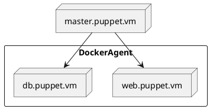

# README

## Control - Repo

TODO: Create/extend an existing puppet module for Nginx including the following functionalities:

- Create a proxy
  - redirect requests for https://domain.com to 10.10.10.10.
  - redirect requests for https://domain.com/resource to 20.20.20.20.
- Create a forward proxy
  - to log HTTP requests going from the internal network to the Internet including:
  - request protocol, remote IP and time take to serve the request.
- (Optional) Implement a proxy health check.

## 0. Preparing Dev Environment

### Dev Environment



### Instruction

- Install VirtualBox: https://www.virtualbox.org
- Install Vagrant: https://www.vagrantup.com
- Download `Vagrantfile`
- Open `Terminal` app or equvalent app.
- Go into the directory of `Vagrantfile`
- VM up and running

    ```bash
    vagrant up
    vagrant ssh
    sudo su -
    ```

- Install yum package manager

    ```bash
    # install yum
    rpm -Uvh https://yum.puppet.com/puppet6-release-el-7.noarch.rpm
    # install Puppetserver, vim and git
    yum install -y puppetserver vim git
    # edit the file and change memory size to 512m from 2g
    vim /etc/sysconfig/puppetserver
    ```

- Puppetserver up and running

    ```bash
    # Start the service of puppetserver
    systemctl start puppetserver
    systemctl status puppetserver
    # Enable this service to start by default when the system reboots
    systemctl enable puppetserver
    ```

- Settings for Puppet

    ```bash
    vim /etc/puppetlabs/puppet/puppet.conf
    # add agents like below. it points itself
    # [agent]
    # server = master.puppet.vm
    ```

- Editing environment variables

    ```bash
    # Ruby, that installed with puppet, making it available through users 
    vim ~/.bash_profile
    # PATH=$PATH:/opt/puppetlabs/puppet/bin
    exec bash
    # Reload bash profile
    source ~/.bash_profile
    # Try use gem if it is 
    gem -h
    ```

- Install r10k with using gem

    ```bash
    gem install r10k
    # gem list --local
    ```

- Starting puppet agent

    ```bash
    puppet agent -t
    ```

- Cloning github repository

    ```bash
    mkdir /etc/puppetlabs/r10k
    vim /etc/puppetlabs/r10k/r10k.yaml
    ```
    
    - Edit with below

        ```yaml
        ---
        :cachedir: '/var/cache/r10k/'
        
        :sources:
          :my-org:
            remote: 'https://github.com/erdnbt/control-repo.git'
            basedir: '/etc/puppetlabs/code/environments'
        ```

- Deploy

    ```bash
    r10k deploy environment -p
    # check the github repo is cloned
    ls /etc/puppetlabs/code/environments/production/
    ```

## Module Explanation

- Puppet NGINX module
    - Link to module: https://forge.puppet.com/modules/puppet/nginx
    - Link to how to start page: https://github.com/voxpupuli/puppet-nginx/blob/master/docs/quickstart.md

For Dev Environment, I created Vagrantfile to see how Puppet works. 
In Puppet Master VM, I installed docker by using Puppet Dockeragent module. In docker, there are two containers running named web.puppet.vm and db..puppet.vm. 
The web side container, I install nginx using Puppet module. 

### Folder & File description

| Folder & File | | Description |
| --: | :-- | :-- |
| manifests/ |  | Puppet Manifest file folder |
|  | site.pp | The "main" manifest that contains a default node definition. |
| site/ |  | Puppet manifests files of Roles & Profiles |
|  | profile/manifests/ | |
|  | role/manifests/ | |
| environment.conf |  | Environment-specific settings. Configures the modulepath and config_version. |
| Puppetfile |  | A list of external Puppet modules to deploy with an environment.  |
| README.md |  | This file |

## Resources

- [Official Puppet Website](https://puppet.com)
- [Puppet Documentation](https://puppet.com/docs/)
- [Learn Puppet](https://learn.puppet.com)
- [Puppet Youtube Channel](https://www.youtube.com/c/Puppet-Inc)
- [bolt documentation](https://puppet.com/docs/bolt/latest/bolt.html)
- [Puppet Community Slack](http://puppetcommunity.slack.com)
